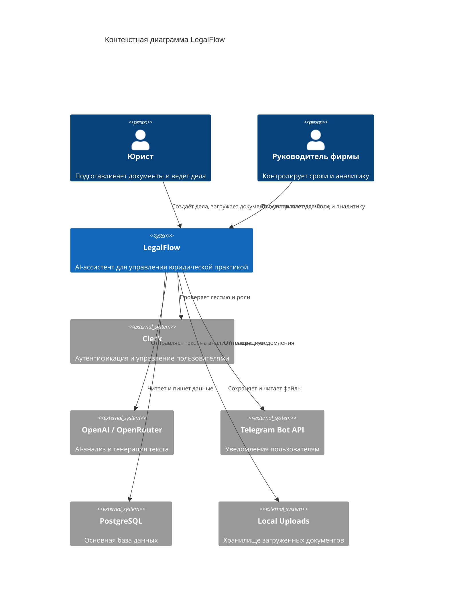
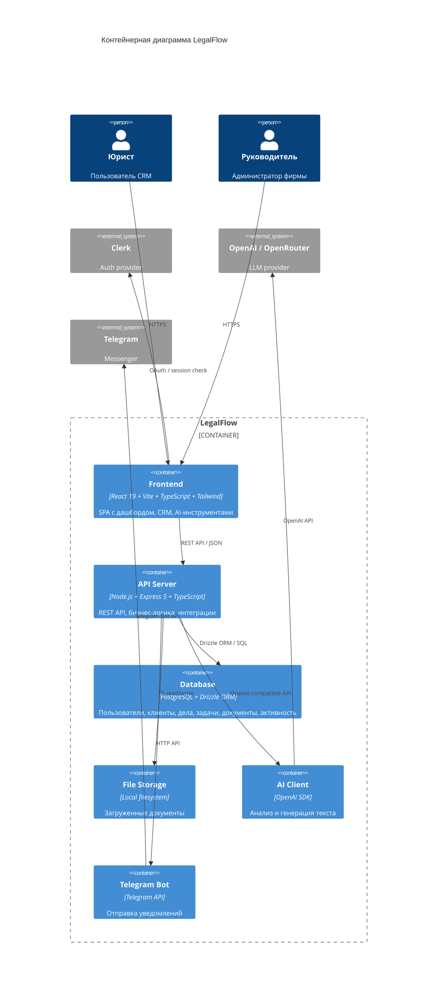

# Архитектурная диаграмма (C4)

## Контекстная диаграмма (C4 Context)

## Контейнерная диаграмма (C4 Container)

## Описание контейнеров

| Контейнер | Технология | Назначение |
|---|---|---|
| **Frontend** | React 19 + Vite + TypeScript + Tailwind CSS 4 | SPA: маркетинговый сайт + CRM + AI-инструменты. Маршрутизация через wouter, состояние через TanStack Query и React Hook Form. |
| **API Server** | Node.js + Express 5 + TypeScript | REST API, бизнес-логика, валидация Zod, аутентификация через Clerk, интеграция с AI и Telegram. Сборка через esbuild. |
| **Database** | PostgreSQL + Drizzle ORM | Хранит пользователей, роли, клиентов, дела, задачи, документы, события календаря, уведомления, активность. |
| **File Storage** | Local filesystem (или S3 в будущем) | Хранение загруженных документов. Путь задаётся переменной `UPLOADS_DIR`. |
| **AI Client** | OpenAI SDK / OpenRouter | Вызов LLM для анализа документов, генерации шаблонов, summary дел, проверки конфликтов. |
| **Telegram Bot** | Telegram Bot API | Отправка уведомлений о задачах и дедлайнах. |

## Ключевые маршруты данных

1. **Аутентификация:** Frontend → Clerk → API Server (Clerk JWT проверяется middleware).
2. **Загрузка документа:** Frontend → API Server → File Storage + Database.
3. **AI-анализ:** Frontend → API Server → AI Client → OpenAI/OpenRouter → API Server → Database.
4. **Уведомление:** API Server → Telegram Bot → Telegram API.

## Масштабирование

- Текущий этап: монолитный Express + PostgreSQL + локальное хранилище, развёрнутый в Replit.
- Будущее: вынести Telegram-уведомления и AI-задачи в очередь (Redis/RabbitMQ), мигрировать файлы в S3, добавить горизонтальное масштабирование API-серверов.
